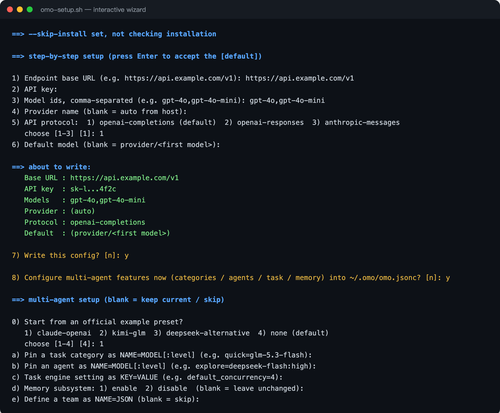

<a id="readme-top"></a>

<div align="center">

# omo-setup

**一键安装并配置 [OmO](https://omo.dev) 的跨平台脚本。**

跑一条命令，剩下的交给向导 —— 检测、安装、填写 base URL / API key / 模型，全程有提示，无需背参数。

[](./LICENSE)
[](#quick-start)
[](./omo-setup.sh)
[](https://nodejs.org)
[](https://github.com/zxfccmm4/omo-setup/stargazers)
[](https://github.com/zxfccmm4/omo-setup/issues)

[快速上手](#quick-start) · [截图](#screenshots) · [能力](#capabilities) · [多智能体](#multi-agent) · [参数](#options) · [常见问题](#faq)

</div>

---

<a id="screenshots"></a>

## 📸 截图

交互式向导会逐步提示每一个设置项，API key 隐藏输入，写盘前先给你一份摘要确认：

[](./assets/setup-wizard.png)

<p align="right">(<a href="#readme-top">回到顶部</a>)</p>

<a id="quick-start"></a>

## 🚀 快速上手

### 一键运行（推荐）

**macOS / Linux**

```bash
curl -fsSL https://raw.githubusercontent.com/zxfccmm4/omo-setup/main/omo-setup.sh | bash
```

**Windows（PowerShell）**

```powershell
irm https://raw.githubusercontent.com/zxfccmm4/omo-setup/main/omo-setup.ps1 | iex
```

> [!NOTE]
> 脚本会自动下载配套的 `omo-config.mjs`（无需手动准备），并从 `/dev/tty` 读取输入 —— 所以 `curl | bash` 也能正常交互。下载默认走 `raw.githubusercontent.com`，失败时自动改用 jsDelivr 镜像（`cdn.jsdelivr.net`），并带连接/总时长超时。

### 三步跑通

1. **安装并配置** —— 运行上面的一键命令，按提示填写 base URL、API key、模型列表；确认后写入配置。
2. **验证 omo 就绪** —— 新开一个终端，确认命令可用：

   ```bash
   omo --version
   ```

3. **开始使用** —— 直接进入交互会话，或一次性提问：

   ```bash
   omo
   # 或
   omo -p "用一句话介绍这个仓库"
   ```

> [!TIP]
> 想让脚本帮你配置多智能体（任务分类、子代理、记忆等），在向导第 8 步选「是」，见[多智能体配置](#multi-agent)。

### 本地运行

```bash
git clone https://github.com/zxfccmm4/omo-setup && cd omo-setup
./omo-setup.sh
```

```powershell
git clone https://github.com/zxfccmm4/omo-setup && cd omo-setup
.\omo-setup.ps1
```

<p align="right">(<a href="#readme-top">回到顶部</a>)</p>

<a id="capabilities"></a>

## ✨ 能力

| 能力 | 说明 |
| --- | --- |
| 🧭 **交互式向导** | 先选语言（English / 简体中文），再逐步引导填写 base URL、API key（输入时逐字符显示 `*`，回车后回显为 `前5位...后5位`，写盘前摘要同样脱敏），自动拉取端点模型列表供编号选择，写盘前先确认。 |
| 🎛️ **模型选择** | 通过 `GET <baseUrl>/models` 拉取可用模型；选模型时可输入关键词先过滤（如 `hdapi` 或 `model-9`）再选编号，支持 `all` / `1,3` / `2-4`；多智能体配置用同一列表。 |
| 🛡️ **拉取不卡死** | 拉取模型列表带 20 秒超时（覆盖响应体读取，服务端挂起连接也不会永久卡住）；失败时打印具体原因（如 `HTTP 401`、`timed out after 20s`）并自动退回手动输入。 |
| 🔔 **告警处理** | 自动判断所配模型是否命中 OmO 官方推荐梯队，未命中时写入 `warnings.offRecommendedModel`，避免启动时的 “Non-recommended model” 提示。 |
| 🔍 **智能检测** | 已安装 `omo` 就跳过安装；未安装则询问后自动安装。 |
| 🖥️ **跨平台** | Linux / macOS 用 `omo-setup.sh`，Windows 用 `omo-setup.ps1`，配置逻辑共用 `omo-config.mjs`。 |
| 🤖 **多智能体** | 可选配置 OmO 的任务分类、子代理、任务引擎、记忆与团队（写入 `~/.omo/omo.jsonc`）。 |
| 🧠 **官方建议** | 内置官方模型-角色匹配摘要（`--advice`）与三个官方示例预设（`--preset`），并提示风险组合。 |
| 🔒 **安全写入** | 确认后才写盘，自动备份原配置，并与已有 provider **合并**而非覆盖。 |

<p align="right">(<a href="#readme-top">回到顶部</a>)</p>

<a id="how-it-works"></a>

## 🔧 脚本流程

1. **检测 omo** —— 在 `PATH` 中查找 `omo`（并兜底检查 `~/.bun/bin`、`~/.local/bin`、`~/.omo/bin` 等常见目录）。
   - 已安装 → 打印版本并**跳过**安装。
   - 未安装 → 询问是否安装，确认后运行官方安装脚本 `curl -fsSL https://get.omo.dev/install.sh | bash`（Windows：`irm https://get.omo.dev/install.ps1 | iex`）；失败时回退到 `bun add -g omo-ai` / `npm i -g omo-ai`。
2. **准备运行时** —— 写配置需要 Node.js 或 Bun；两者都没有时自动安装（Homebrew / NodeSource APT / Bun 脚本，见[依赖](#requirements)）。
3. **逐步配置** —— 先选语言（English / 简体中文），再依次询问 base URL、API key（输入时逐字符显示 `*`，回车后该行回显为 `前5位...后5位`，不泄露完整 key）；脚本会尝试拉取 `GET <baseUrl>/models` 并把模型列表编号列出，可先输关键词过滤再选编号（`all` / `1,3` / `2-4` 均支持），拉取失败则打印原因并退回手动输入。随后是 provider 名称、API 协议、默认模型，最后打印摘要（模型多时只列前几个、API key 已脱敏）并请求确认。
4. **写入配置** —— 确认后才写盘；输入 `n` 取消且不产生任何文件。

<p align="right">(<a href="#readme-top">回到顶部</a>)</p>

<a id="files"></a>

## 📦 写入的配置文件

默认目录 `~/.omo/agent`（可用 `OMO_CODING_AGENT_DIR` 覆盖）。

| 文件 | 作用 |
| --- | --- |
| `~/.omo/agent/models.json` | 新增/更新 `providers.<名称>`（`baseUrl` / `api` / `apiKey` / `models`）。 |
| `~/.omo/agent/settings.json` | 设置 `defaultProvider` / `defaultModel`。 |
| `~/.omo/omo.jsonc` | 多智能体配置（分类 / 代理 / 任务 / 团队 / 记忆），仅在使用多智能体参数时写入。 |

`models.json` —— 新增/更新 `providers.<名称>`：

```json
{
  "providers": {
    "example-com": {
      "baseUrl": "https://api.example.com/v1",
      "api": "openai-completions",
      "apiKey": "sk-xxx",
      "models": [{ "id": "gpt-4o", "name": "gpt-4o" }]
    }
  }
}
```

`settings.json` —— 设置默认模型：

```json
{
  "defaultProvider": "example-com",
  "defaultModel": "example-com/gpt-4o"
}
```

> [!IMPORTANT]
> 写入前会自动生成时间戳备份（`<文件>.bak.<时间戳>`），并与已有配置**合并**而非覆盖。

<p align="right">(<a href="#readme-top">回到顶部</a>)</p>

<a id="multi-agent"></a>

## 🤖 多智能体配置

除了 provider，脚本还能把 OmO 的多智能体功能写进 `~/.omo/omo.jsonc`（该文件在 OmO 根目录，是 `agent/` 的上一级）。向导第 8 步会询问是否配置，非交互模式则用下面的参数。

### 先看官方建议

脚本内置了官方 [Agent-Model Matching 指南](https://github.com/code-yeongyu/oh-my-openagent/blob/dev/docs/guide/agent-model-matching.md) 的摘要，随时可查：

```bash
./omo-setup.sh --advice
```

核心结论（**大多数人不配也能用**，OmO Native 会自动为每个分类和代理选模型）：

- **主代理推荐梯队**（按优先级）：Claude Opus 5.5 → Claude Fable 5.1 → Kimi K3 → GPT-6 Astra → GPT-6.1 Sol → GPT-6 Sol → GLM 5.3。梯队外的模型官方不保证。
- **模型家族要对得上角色**：Claude 系 → 主代理与 `plan-consultant`；GPT 系 → `plan-reviewer`、`ultrabrain`、`deep-low`、`deep-high`；小而快的模型 → `explore`、`librarian`、`quick`。
- **别把贵模型放错位置**：`explore`/`librarian` 用 Opus/Fable 是巨大的浪费；`plan-reviewer` 用小模型会沦为橡皮图章。

> [!WARNING]
> 配置时脚本会自动检查上述**风险组合**并打印 `advice:` 提示；确认无误可加 `--no-advice` 关闭。

### 从官方示例起步（presets）

内置三个官方示例，可直接当模板再微调 provider 前缀：

```bash
./omo-setup.sh --preset claude-openai        # 官方 Example A：Claude + OpenAI
./omo-setup.sh --preset kimi-glm             # 官方 Example B：Kimi/GLM 接管 Claude 类角色
./omo-setup.sh --preset deepseek-alternative # 官方 Example C：DeepSeek 作 GPT 备用链
```

preset 与你自己的参数可以叠加，且**你的显式指定优先**：

```bash
./omo-setup.sh --preset claude-openai --category deep-high=anthropic/claude-opus-5-5:max
```

向导第 8 步的第一步（`0)`）也会询问是否选用某个 preset。

> [!NOTE]
> 只写了多智能体参数、没写 provider 参数时，脚本会跳过 provider 向导，只更新 `omo.jsonc`。

### 常用参数速查

| 目标 | 命令 |
| --- | --- |
| 任务分类 | `--category architect=anthropic/claude-opus-5-5:max` |
| 子代理 | `--agent explore=deepseek-flash:high` |
| 任务引擎 | `--task default_concurrency=4 --task max_depth=2` |
| 记忆开关 | `--memory on`（或 `off`） |
| 定义团队 | `--team 'reviewers={"leadAgentId":"lead","members":[...]}'` |
| 任意字段 | `--set-json '{"git_master":{"commit_footer":true}}'` 或 `--omo-json ./my-omo.jsonc` |

<details>
<summary><b>展开：完整命令示例</b></summary>

**任务分类（categories）** —— 给某一类任务指定模型与推理档位：

```bash
./omo-setup.sh --category architect=anthropic/claude-opus-5-5:max \
               --category quick=glm-5.3-flash
```

**子代理（agents）** —— 覆盖内置代理（`explore` / `librarian` / `plan-consultant` / `plan-reviewer`）：

```bash
./omo-setup.sh --agent explore=deepseek-flash:high
```

**任务引擎（task）** —— 并发数、最大深度、执行模式等：

```bash
./omo-setup.sh --task default_concurrency=4 --task max_depth=2 \
               --task 'wait={"default_ms":90000}'
```

**记忆与团队** —— 开关记忆子系统，或定义团队：

```bash
./omo-setup.sh --memory on \
  --team 'reviewers={"leadAgentId":"lead","members":[{"kind":"category","name":"quick","category":"deep-low","prompt":"Review the diff."}]}'
```

**任意字段** —— 用 `--set-json` 或 `--omo-json <文件>` 深度合并任意合法配置：

```bash
./omo-setup.sh --set-json '{"git_master":{"commit_footer":true}}'
./omo-setup.sh --omo-json ./my-omo.jsonc
```

</details>

写入时会读取现有 `omo.jsonc`（支持 `//` 注释与尾逗号）并**深度合并**：同名对象递归合并，数组/标量整体替换；写入前自动备份为 `omo.jsonc.bak.<时间戳>`。若只想配 provider，加 `--no-agent-config` 即可完全不碰 `omo.jsonc`。

生成的配置符合 [OmO 官方 schema](https://raw.githubusercontent.com/code-yeongyu/oh-my-openagent/dev/assets/omo.schema.json)，文件顶部会自动补上 `$schema` 以便编辑器提示。

<p align="right">(<a href="#readme-top">回到顶部</a>)</p>

<a id="non-interactive"></a>

## 🖥️ 非交互模式（脚本 / CI）

一次性传入参数或环境变量，脚本会跳过向导：

**命令行参数**

```bash
curl -fsSL https://raw.githubusercontent.com/zxfccmm4/omo-setup/main/omo-setup.sh | bash -s -- \
  --base-url https://api.example.com/v1 --api-key sk-xxx --models gpt-4o,gpt-4o-mini
```

**环境变量**

```bash
OMO_BASE_URL=https://api.example.com/v1 \
OMO_API_KEY=sk-xxx \
OMO_MODELS=gpt-4o \
./omo-setup.sh
```

**Windows（PowerShell）**

```powershell
.\omo-setup.ps1 -BaseUrl https://api.example.com/v1 -ApiKey sk-xxx -Models gpt-4o,gpt-4o-mini
```

> [!TIP]
> 想强制运行向导，加 `-i` / `--interactive`（PowerShell：`-Interactive`）。

<p align="right">(<a href="#readme-top">回到顶部</a>)</p>

<a id="options"></a>

## 📋 参数

| 参数 | 环境变量 | 说明 |
| --- | --- | --- |
| `-i`, `--interactive` / `-Interactive` | — | 强制运行交互向导（即使已提供参数） |
| `--base-url` / `-BaseUrl` | `OMO_BASE_URL` | 接口 base URL |
| `--api-key` / `-ApiKey` | `OMO_API_KEY` | API key |
| `--models` / `-Models` | `OMO_MODELS` | 逗号分隔的模型 id 列表 |
| `--models-file` / `-ModelsFile` | — | 从文件读取模型列表（每行 `id<TAB>名称`） |
| `--lang` / `-Lang` | `OMO_LANG` | 向导与输出语言：`en`（默认）\| `zh` |
| `--recommended-warning` / `-RecommendedWarning` | — | 是否静默 “Non-recommended model” 提示：`on` \| `off` \| `auto`（默认，未命中推荐梯队时写入） |
| `--provider` / `-Provider` | `OMO_PROVIDER` | provider 名称，默认从域名推导 |
| `--api-type` / `-ApiType` | `OMO_API_TYPE` | `openai-completions`（默认）\| `openai-responses` \| `anthropic-messages` |
| `--default-model` / `-DefaultModel` | `OMO_DEFAULT_MODEL` | 默认模型，默认 `provider/<第一个模型>` |
| `--no-default` / `-NoDefault` | — | 不修改 `settings.json` 的默认模型 |
| `--dry-run` / `-DryRun` | — | 只打印将要做的改动，不写盘 |
| `--skip-install` / `-SkipInstall` | — | 只配置，不做安装检测 |
| `--allow-root` | `OMO_INSTALL_ALLOW_SUDO=1` | 允许以 root 安装 omo（仅 `omo-setup.sh`） |
| `--category` / `-Category` | — | 固定任务分类，`NAME=MODEL[:LEVEL]`，可重复 |
| `--agent` / `-Agent` | — | 固定子代理模型，`NAME=MODEL[:LEVEL]`，可重复 |
| `--task` / `-TaskSetting` | — | 设置任务引擎键值，`KEY=VALUE`，可重复 |
| `--memory` / `-Memory` | — | 开关记忆子系统，`on` \| `off` |
| `--team` / `-Team` | — | 定义团队，`NAME=JSON`，可重复 |
| `--set-json` / `-SetJson` | — | 深度合并任意 JSON 片段，可重复 |
| `--omo-json` / `-OmoJson` | — | 深度合并一个 JSON/JSONC 文件 |
| `--no-agent-config` / `-NoAgentConfig` | — | 完全不修改 `omo.jsonc` |
| `--advice` / `-Advice` | — | 打印官方多智能体推荐并退出 |
| `--preset` / `-Preset` | — | 从官方示例起步：`claude-openai` \| `kimi-glm` \| `deepseek-alternative`，可重复 |
| `--no-advice` / `-NoAdvice` | — | 关闭风险组合提示 |

<p align="right">(<a href="#readme-top">回到顶部</a>)</p>

<a id="requirements"></a>

## 🧩 依赖

- 配置写入需要 **Node.js >= 18** 或 **Bun**（脚本自动选择可用运行时）。**两者都没有时会自动安装**：macOS 用 Homebrew，Debian/Ubuntu 用 NodeSource APT 源（需要 sudo），其他平台回退到 Bun 官方安装脚本；全失败才报错退出。
- 安装 omo 需要 `curl`（推荐）、或 `bun` / `npm`。
- 下载 `omo-config.mjs` 和拉取模型列表都需要能访问 `raw.githubusercontent.com`（或镜像 `cdn.jsdelivr.net`）和你的端点。

<p align="right">(<a href="#readme-top">回到顶部</a>)</p>

<a id="faq"></a>

## ❓ 常见问题

<details>
<summary><b>多智能体配置要一个个手输分类名，太繁琐？</b></summary>

已优化：分类和子代理名称会列出内置菜单（分类：`architect`/`artistry`/`quick`/`deep-low`/`deep-high`/`ultrabrain`/`unspecified-low`/`unspecified-high`/`visual-engineering`/`writing`；子代理：`explore`/`librarian`/`plan-consultant`/`plan-reviewer`），输编号即可，也支持 `0` 手动输入。选模型时同样支持先输关键词过滤（如 `hdapi`）再选编号，输 `r` 可展开完整列表；每一步都可直接回车跳过。

</details>

<details>
<summary><b>macOS 报 <code>mktemp: mkstemp failed ... File exists</code>？</b></summary>

已修复。macOS 的 BSD `mktemp` 只替换模板**末尾**的 `X`，旧版脚本用 `omo-config.XXXXXX.mjs` 作模板会生成同名文件，第二次运行就报 File exists。现在改为先建临时目录再放入 `omo-config.mjs`。升级到最新脚本即可；旧的残留文件可删：`rm -f /tmp/omo-config.XXXXXX.mjs`。

</details>

<details>
<summary><b>卡在「正在从端点获取模型列表…」怎么办？</b></summary>

向导拉取模型列表最长等 20 秒：如果端点发完响应头后挂起不发数据，会超时并打印 `timed out after 20s`，然后让你手动输入模型 id，不会永久卡住。若失败信息是 `HTTP 401`，检查 API key；若是连接错误，检查 base URL 和网络。任何情况下都可以直接手动输入逗号分隔的模型 id 继续，或改用非交互模式传 `--models`。

</details>

<details>
<summary><b>下载 <code>omo-config.mjs</code> 失败或很慢（国内网络）？</b></summary>

脚本会先试 `raw.githubusercontent.com`，失败或超时（10 秒连接 / 120 秒总时长）后自动改用 jsDelivr 镜像 `cdn.jsdelivr.net/gh/zxfccmm4/omo-setup@main/omo-config.mjs`。两个都不可达时脚本会报错退出；此时可以手动下载该文件放到脚本同目录（`curl | bash` 运行时即当前目录）——本地文件优先于网络下载。

</details>

<details>
<summary><b>远程执行时 API key 输入会卡住？</b></summary>

向导从 `/dev/tty` 读取输入，因此 `curl | bash` 也能正常交互。若在无终端的 CI 环境运行，请改用非交互模式传入 `--base-url/--api-key/--models`。

</details>

<details>
<summary><b>以 root 运行时报 <code>refusing to run as root</code>？</b></summary>

omo 官方安装器默认拒绝 root。脚本会检测到这一点并提示：可确认后自动加上 `OMO_INSTALL_ALLOW_SUDO=1` 继续安装，或改用非 root 用户运行。非交互场景直接传 `--allow-root`（等价于 `OMO_INSTALL_ALLOW_SUDO=1`）：

```bash
curl -fsSL https://raw.githubusercontent.com/zxfccmm4/omo-setup/main/omo-setup.sh | bash -s -- --allow-root
```

注意：以 root 安装会把配置写到 `/root/.omo`；多用户机器更推荐用普通用户运行。

</details>

<details>
<summary><b><code>omo</code> 装好了但提示找不到？</b></summary>

新开的终端才能刷新 `PATH`。也可以手动执行 `export PATH="$HOME/.bun/bin:$PATH"`（或重启终端）后重试。

</details>

<details>
<summary><b>想单独使用配置脚本，不走向导？</b></summary>

直接调用共享脚本：

```bash
node omo-config.mjs --base-url https://api.example.com/v1 --api-key sk-xxx --models gpt-4o
```

辅助子命令（向导内部也在用，可单独调用）：

```bash
# 拉取端点模型列表（输出 id<TAB>名称，可直接喂给 --models-file）
node omo-config.mjs --fetch-models --base-url https://api.example.com/v1 --api-key sk-xxx > models.txt
node omo-config.mjs --base-url https://api.example.com/v1 --api-key sk-xxx --models-file models.txt

# 查看从域名推导出的 provider 名 / 已配置的模型
node omo-config.mjs --print-provider --base-url https://api.example.com/v1
node omo-config.mjs --print-models --provider example-com
```

`--lang en|zh` 控制输出语言，`--recommended-warning on|off|auto` 控制是否写 `warnings.offRecommendedModel`。

</details>

<details>
<summary><b>安装完提示 <code>No models available</code> / <code>Non-recommended model</code>？</b></summary>

`No models available` 是没有任何 provider 配置时的提示——走完向导写入 provider 后不会再出现。`Non-recommended model` 来自 OmO 内置的推荐模型检查：脚本会自动判断所配模型是否命中官方推荐梯队（`claude-opus-5-5` / `claude-fable-5-1` / `kimi-k3` / `gpt-6-astra` / `gpt-6.1-sol` / `glm-5.3`，含 `-fast` 等后缀归一化），命中则优先设为默认模型；未命中则写入 `settings.json → warnings.offRecommendedModel: true` 静默该提示。用 `--recommended-warning on` 可保留提示。

</details>

<details>
<summary><b><code>--dry-run</code> 会写文件吗？</b></summary>

不会。只打印将要写入的路径与内容摘要。

</details>

<details>
<summary><b>配置文件在哪？</b></summary>

默认 `~/.omo/agent`；可用环境变量 `OMO_CODING_AGENT_DIR`（旧版：`SENPI_CODING_AGENT_DIR` / `PI_CODING_AGENT_DIR`）覆盖。多智能体配置写在 `~/.omo/omo.jsonc`，可用 `OMO_OMO_JSONC` 覆盖路径。

</details>

<p align="right">(<a href="#readme-top">回到顶部</a>)</p>

## 📜 License

[MIT](./LICENSE)

---

<div align="center">

### ⭐ Star 趋势

[](https://star-history.com/#zxfccmm4/omo-setup&Date)

<sub>如果这个脚本帮到了你，欢迎点个 Star ⭐</sub>

</div>
